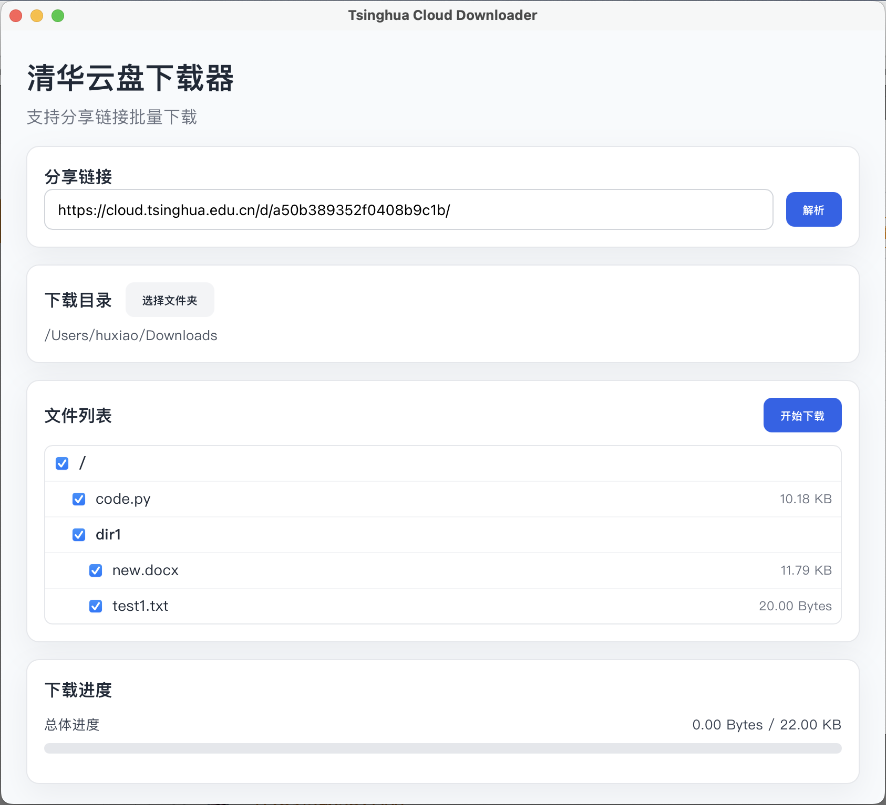
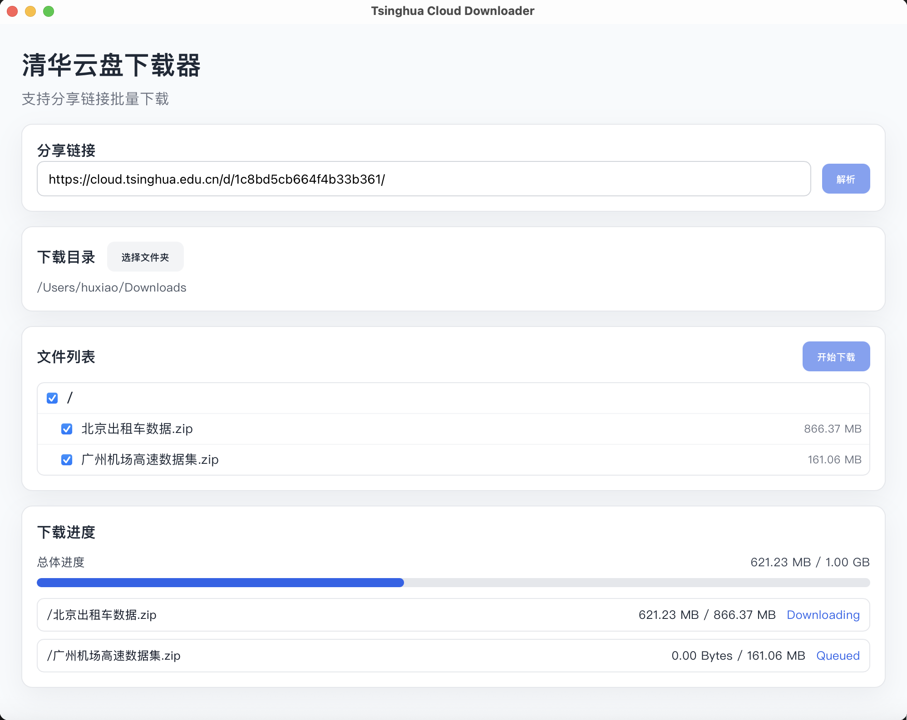
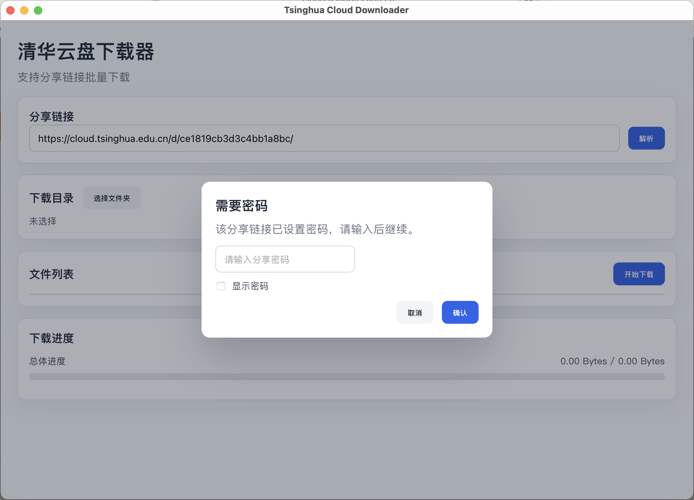

# Tsinghua Tools

清华大学相关工具集，解决校园网络服务使用中的痛点问题。

## 工具列表

### 云盘下载器 (cloud-downloader)

解决清华云盘（Seafile）分享链接无法批量下载大量文件/大文件夹的问题。

#### 截图预览

| 主界面 - 文件选择 | 下载进度 |
|:---:|:---:|
|  |  |

<p align="center">
  
  <br>
  <em>密码保护链接支持</em>
</p>

#### 功能特性

- **批量下载**：一键下载分享链接中的所有文件，支持文件夹递归解析
- **选择性下载**：勾选需要的文件/文件夹，无需全部下载
- **大文件支持**：流式传输，不占用大量内存，支持 GB 级文件
- **断点续传**：下载中断后可从断点继续，无需重新下载
- **密码保护**：支持带密码的分享链接，自动弹窗输入
- **实时进度**：单文件进度 + 总体进度实时显示

**下载安装**：
- 前往 [Releases](https://github.com/HuXiao-THU/Tsinghua-Tools/releases) 页面下载
- **Mac 用户**：下载 `.dmg` 文件，双击打开后拖入"应用程序"
- **Windows 用户**：下载 `.msi` 或 `.exe` 安装包

**使用方法**：
1. 复制清华云盘分享链接（如 `https://cloud.tsinghua.edu.cn/d/xxxxxx/`）
2. 粘贴到应用中，点击"解析"
3. 选择需要下载的文件/文件夹
4. 选择本地保存目录
5. 点击"开始下载"

**技术栈**：Tauri 2 + React + TypeScript + Rust

---

### [归档] Python 版本 (cloud-downloader-legacy)

旧版 Python 命令行实现，不再维护。如需使用请参考 `cloud-downloader-legacy/` 目录。

---

## 开发

### 云盘下载器开发

```bash
cd cloud-downloader
npm install
npm run tauri:dev
```

### 构建

```bash
npm run tauri:build
```

产物位于 `cloud-downloader/src-tauri/target/release/bundle/`

---

## 贡献

欢迎提交 Issue 和 Pull Request！

## 许可证

[MIT](LICENSE)
